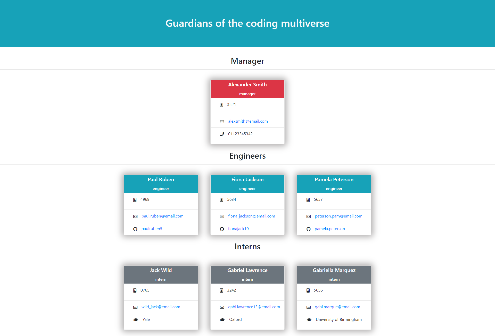
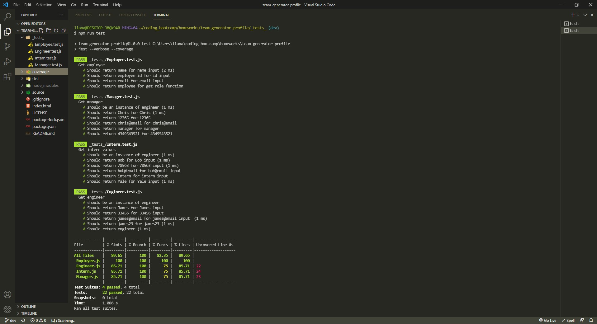
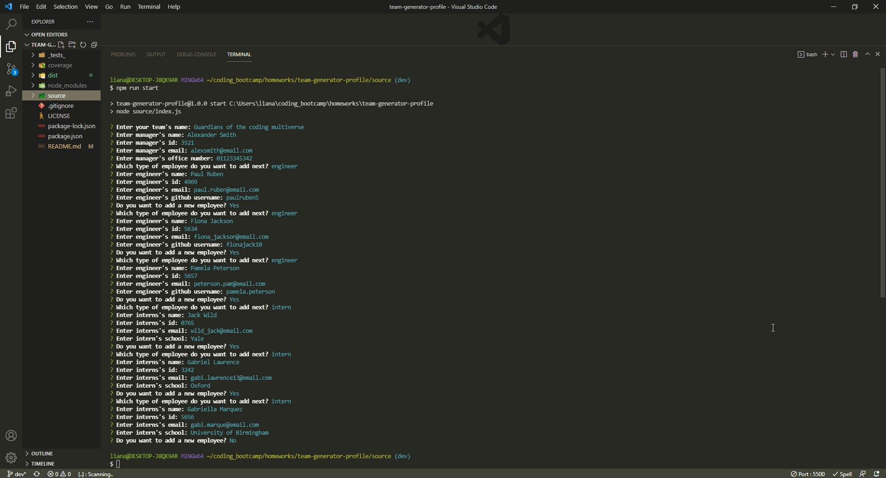

# Team Profile Generator [](https://opensource.org/licenses/MIT)

A Node.js command-line application that takes in information about employees on a software engineering team, then generates an HTML webpage that displays summaries for each person.

## Table of Contents

- [Team Profile Generator ](#team-profile-generator-)
  - [Table of Contents](#table-of-contents)
  - [Description](#description)
  - [User Story](#user-story)
  - [Demo link](#demo-link)
  - [Getting started](#getting-started)
    - [Installation](#installation)
    - [Testing](#testing)
    - [Usage](#usage)
  - [Contributing & Questions](#contributing--questions)
  - [Licence](#licence)
  - [Screenshots](#screenshots)

## Description

In this project I created a command line Node Js application that accepts the user's input information about employees for 3 categories (manager, engineer, intern) on an engineering team and then generates a HTML page that summarises the input details.

The application verifies for the user input, by validating each name, email, id or github input. Before creating the application, test were built and run using Jest framework.

## User Story

```md
AS A manager
I WANT to generate a webpage that displays my team's basic info
SO THAT I have quick access to their emails and GitHub profiles
```

```md
GIVEN a command-line application that accepts user input
WHEN I am prompted for my team members and their information
THEN an HTML file is generated that displays a nicely formatted team roster based on user input
WHEN I click on an email address in the HTML
THEN my default email program opens and populates the TO field of the email with the address
WHEN I click on the GitHub username
THEN that GitHub profile opens in a new tab
WHEN I start the application
THEN I am prompted to enter the team manager’s name, employee ID, email address, and office number
WHEN I enter the team manager’s name, employee ID, email address, and office number
THEN I am presented with a menu with the option to add an engineer or an intern or to finish building my team
WHEN I select the engineer option
THEN I am prompted to enter the engineer’s name, ID, email, and GitHub username, and I am taken back to the menu
WHEN I select the intern option
THEN I am prompted to enter the intern’s name, ID, email, and school, and I am taken back to the menu
WHEN I decide to finish building my team
THEN I exit the application, and the HTML is generated
```

## Demo link

Click [here](https://drive.google.com/file/d/1Y-wvkYnxIUYZ6RthXVtDxfJCTjRg5IH-/view) to watch the demo application.

## Getting started

### Installation

Run the following scripts to install the application:

- clone repo `git clone git@github.com:lianavaleria15/team-generator-profile.git`
- run `npm install` on the terminal to install all dependencies required in `package.json`

### Testing

Run the following script to run the tests:

- `npm run test` on the terminal

### Usage

Run the following script to run the application:

- `npm run start` on the terminal

## Contributing & Questions

If you have any questions related to the application or repository, would like to collaborate or open an issue, please use the contact details below:

- 👩 [Liana Laurentiu](https://github.com/lianavaleria15)
- 📧 [liana.valeria15@gmail.com](mailto:liana.valeria15@gmail.com)

## Screenshots

### Live app



### Test run results



### Inquirer prompted questions

)
